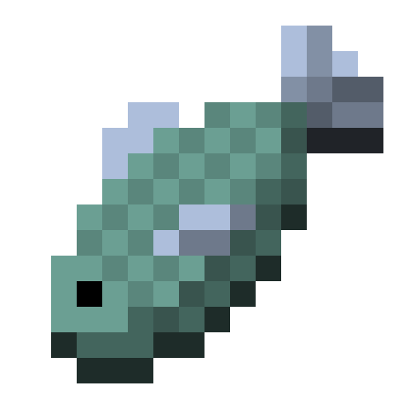

<html>
<head>
<title>Steak Web</title>
<meta charset="utf-8">
<meta content="width=device-width, initial-scale=1.0, maximum-scale=3.0, user-scalable=1" name="viewport">
<meta name="description" content="Steak Web由牛排吖制作，是一个为上课摸鱼的同志们量身打造的起始页。Steak Web以最简洁的界面容纳了内置导航栏、超链接网站捷径、伪息屏等实用功能，让您的网上冲浪体验更加舒心(bushi)。">
<link rel="shortcut icon" href="pic/icon.png">
<link rel="apple-touch-icon" href="pic/icon.png">

</head>
<body id="bg" onload="load();">

</img>
 
加载中...

Steak Web
 
 ——为摸鱼的同志们量身打造

<input type="button" class="btn" value="开始摸鱼awa" onclick="SFish();">

<input type="button"  class="btn" value="算了认真学习" onclick="window.close();">

</body>

</html>

